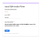

# Using Google Forms to submit GitHub Issues with Ease | by Will Blanton | Medium


https://medium.com/@01010111/using-google-forms-to-submit-github-issues-efdb5f876b

---

# Using Google Forms to submit GitHub Issues with Ease

[](https://medium.com/@01010111?source=post_page-----efdb5f876b--------------------------------)

[Will Blanton](https://medium.com/@01010111?source=post_page-----efdb5f876b--------------------------------)

[Apr 2, 2019·8 min read](https://medium.com/@01010111/using-google-forms-to-submit-github-issues-efdb5f876b?source=post_page-----efdb5f876b--------------------------------)


Simplify issue submission and learn a bit about the GitHub API


I often have trouble getting people to submit issues on GitHub. Whether it’s a collaborator who doesn’t want to deal with a GitHub account, or someone testing a game or project to whom I don’t want to grant access to the repo, it can be a pain juggling emails and messages and issues all at once. Luckily there’s a pretty easy way to use a Google Form to populate issues.

What you’ll need to complete this tutorial:

- GitHub account
- GitHub repository
- Google Drive account

Are you new to GitHub? Check out [this article](https://medium.com/@01010111/managing-your-home-using-github-266d7258eb9a) I wrote on Managing Your Home Using GitHub!

# Step One: Create a new Personal Access Token

To create a Personal Access Token, you’ll have to open your account settings:


On desktop, it’s in the upper right hand corner

From there you’ll use the navigation menu on the left to select `Developer settings` and then `Personal access tokens`.

Next, you’ll click the `Generate new token` button. You’ll be asked to enter your password because any outside apps you give this token to will have access to certain parts of your GitHub account. You don’t want to give it to anyone!

From there, you’ll want to give the token a description — something like `Google Forms to GitHub Issue` should be fine — and then you’ll want to only give it access to repos:


From there, you’ll click `Generate token` and you’ll be taken back to your Personal access tokens. The token you’ve just generated will be highlighted in green, make sure to copy it down somewhere!


Before you try and funny business, don’t worry I’ve already deleted this one :)

Forget to copy it down? No worries — just delete it and make a new one 👍

# Step Two: Create a new Form

Next thing you’ll want to do is create a new form using Google Drive. For now, let’s just make the form super simple, a Title and a Description:


You’ll probably want to make both of these required!

Go to the `Responses` tab and look for the green `Create spreadsheet` button and press it:


You’ll want to `Create a new spreadsheet`, name it and hit the `Create` button. Now you’ll be taken to that spreadsheet.

# Step Three: Create a Script to Submit Issues

From your spreadsheet’s menu, go to `Tools` > `Script editor`. This will open up a script editor in a new tab. You’ll want to erase the script currently in there and replace it with this:

```
var token = "YOUR_TOKEN_HERE";
var handle = "YOUR_HANDLE_HERE";
var repo = "YOUR_REPO_HERE";function onFormSubmit(e)
{
 
    var title = e.values[1];
    var body = e.values[2];    var payload = {
        "title": title,
        "body": body
    };
 
    var options = {
        "method": "POST",
        "contentType": "application/json",
        "payload": JSON.stringify(payload)
    };   var response = UrlFetchApp.fetch("https://api.github.com/repos/"+handle+"/"+repo+"/issues?access_token="+token, options);}
```

The first thing you’ll want to do is change the three variables at the top. Paste your Personal Access Token into the first set of quotation marks, your GitHub username into the second set, and the name of your repository into the third.

Now if we take a look bit by bit, we can see how this script is set up:

```
function onFormSubmit(e)
```

This is the name of the main function in our script. By the way it’s named you can probably tell that we want this script to be run when a form is submitted.

The `e` represents all the data that will come through when a form is submitted!

```
    var title = e.values[1];
    var body = e.values[2];
```

this bit sets up two new variables, `title` and `body`. You can see we are setting those variables to two values from our form submission data `e`. We get the two numbers `1` and `2` from the order those values appear in our spreadsheet:


Notice we have our `title` variable referencing `e.values[1]`. On our spreadsheet, the Issue title is in the `B` column. Our spreadsheet columns are represented starting from `A` in our spreadsheet, but in our script they start at `0` and count up. This means if we add questions to our form and we want to reference something in column `E`, we’ll use `e.values[4]`.

```
    var payload = {
        "title": title,
        "body": body
    };
```

This next bit is what we’re sending to GitHub so that an issue is created. It defines the title and body of an issue. To understand where these come from, you can check out [GitHub’s API for creating an issue](https://developer.github.com/v3/issues/#create-an-issue).

```
    var options = {
        "method": "POST",
        "contentType": "application/json",
        "payload": JSON.stringify(payload)
    };
```

This bit is how that data is formatted so that GitHub can parse it. You don’t need to worry about it!

```
var response = UrlFetchApp.fetch("https://api.github.com/repos/"+handle+"/"+repo+"/issues?access_token="+token, options);
```

This line submits all of our data to GitHub. No need to edit this either!

Our script is ready to be saved and set up! Save your script by naming it — I’ve named mine `Issue Submission Script` and then go to `Edit` > `Current project's triggers`.

This will open a new tab — The G Suite Developer Hub — from here, click on `create a new trigger`:


From there you’ll want to set a few options:

- `Choose which function to run` should be set to `onFormSubmit` — this should be the only function in your script
- `Select event source` should be set to `On form submit` — that way our function will be called when a form is submitted
- `Failure notification settings` should be set to `Notify me immediately` — this is just in case we get an error, a summary will be sent to your email


Click save, and you’ll be asked to confirm a few things. Google will probably throw up this screen:


VERY SPOOKY STUFF

You don’t have to worry, because you understand every line of your script :)

Click on `Advanced` and then `Go to [your script name] (unsafe)`, then just click `Allow`.

that’s it! Let’s take it for a whirl!

# Step Four: Testing Out Our Form

Go back to the form, and click on the `Preview` button.


The all-seeing Preview Button

This will let you fill out your form and submit a response. Put whatever you’d like into the fields and hit `Submit`!




If everything worked the way it’s supposed to, you should be able to see an issue back on your GitHub repo!


If something went wrong, you’ll get an email that will hopefully tell you why. I’ll mention now that I’ve gotten a few errors doing this even though the issue was submitted perfectly fine, but if you get an error and the issue hasn’t been submitted to your GitHub repo, you’ll want to dig deeper into what went wrong.

# Step Five: Labels

Labels are a great tool for organizing Issues on GitHub. Let’s add some of that functionality to our form!

One easy way to do it is to figure out what labels are mutually exclusive to each other. A default GitHub repo starts out with 8 labels: `bug` `duplicate` `enhancement` `good first issue` `help wanted` `invalid` `question` `wontfix`

Most issues will fall into one of three categories:

- `bug` — Something isn’t working
- `enhancement` — New feature or request
- `question` — Further information is requested

Let’s add a Multiple Choice question to our form:


make sure the labels you add here perfectly match the labels on your GitHub repo!

Now let’s add the following to our script:

```
var token = "YOUR_TOKEN_HERE";
var handle = "YOUR_HANDLE_HERE";
var repo = "YOUR_REPO_HERE";function onFormSubmit(e)
{
 
    var title = e.values[1];
    var body = e.values[2];
    var type = e.values[3];    var labels = [];
    labels.push(type);    var payload = {
        "title": title,
        "body": body,
        "labels": labels
    };
 
    var options = {
        "method": "POST",
        "contentType": "application/json",
        "payload": JSON.stringify(payload)
    };    var response = UrlFetchApp.fetch("https://api.github.com/repos/"+handle+"/"+repo+"/issues?access_token="+token, options);}
```

Let’s check out what we’ve added!

```
    var type = e.values[3];
```

We’ve added a new variable `type` and it’s reading from column `D` of our spreadsheet.

```
    var labels = [];
    labels.push(type);
```

We create a new variable called `labels`, this variable is an array, which means it can hold multiple values of the same type. We use the `push()` function to add our `type` variable to the `labels` array. Maybe later you’ll want to add another label — for instance, you could create a new label to denote an issue was created using a Google Form!

```
    var payload = {
        "title": title,
        "body": body,
        "labels": labels
    };
```

Finally, we add our `labels` to the payload. Make sure you add the comma to the end of `"body: body,`!

Save your modified script, and fill out your form again to test it!


Wow! No bugs!

# Wrapping Up

All you have to do now is click the big `Send` button on your google form and grab the URL to share with all of your teammates!


There are, of course, a few caveats to this method:

- All of the issues look like they’re coming from you. You could fix this somewhat by adding another field to your form to get a name, and then add it to your script like this (make sure to double check which column new fields show up in your spreadsheet!):

```
var body = e.values[2] + "\n-" + e.values[5];
```

- You won’t be able to use all of the features of GitHub issues, like communicating in threads, `@`ing teammates, assigning teammates, and more.

In the end, using the GitHub API can accomplish a lot! You can get creative with collecting more data from a form and formatting your submitted issues!

Have fun!

WRITTEN BY

[Will Blanton](https://medium.com/@01010111?source=post_sidebar--------------------------post_sidebar-----------)

#### Makin games | Makin tunes | Makin ⊙▽⊙ faces

Follow


#### 25


#### [No rights reserved](http://creativecommons.org/publicdomain/zero/1.0/)

####  by the author.

25 


- [Google Forms](https://medium.com/tag/google-forms)
- [Github](https://medium.com/tag/github)
- [JavaScript](https://medium.com/tag/javascript)
- [Programming](https://medium.com/tag/programming)
- [Project Management](https://medium.com/tag/project-management)

## [More from Will Blanton](https://medium.com/@01010111?source=follow_footer-------------------------------------)

Follow

#### Makin games | Makin tunes | Makin ⊙▽⊙ faces

[Apr 2, 2019](https://medium.com/@01010111/managing-your-home-using-github-266d7258eb9a?source=follow_footer---------0----------------------------)

# [Managing your home using GitHub](https://medium.com/@01010111/managing-your-home-using-github-266d7258eb9a?source=follow_footer---------0----------------------------)

*A guide to managing your home and learning how to use GitHub along the way*


At work I like to be as organized as possible. I have todo lists, issue tracking, calendar events, even my laptop’s desktop is impeccably organized. At home, it’s a different story — dishes pile up in the sink, the dirty laundry hamper becomes the clean laundry storage, empty toilet paper rolls remain on the dispenser — I could go on. It’s tough to keep track of all of the things a home requires. More importantly, there’s the ever-growing list of repairs, improvements, and maintenance chores that need to be done. …